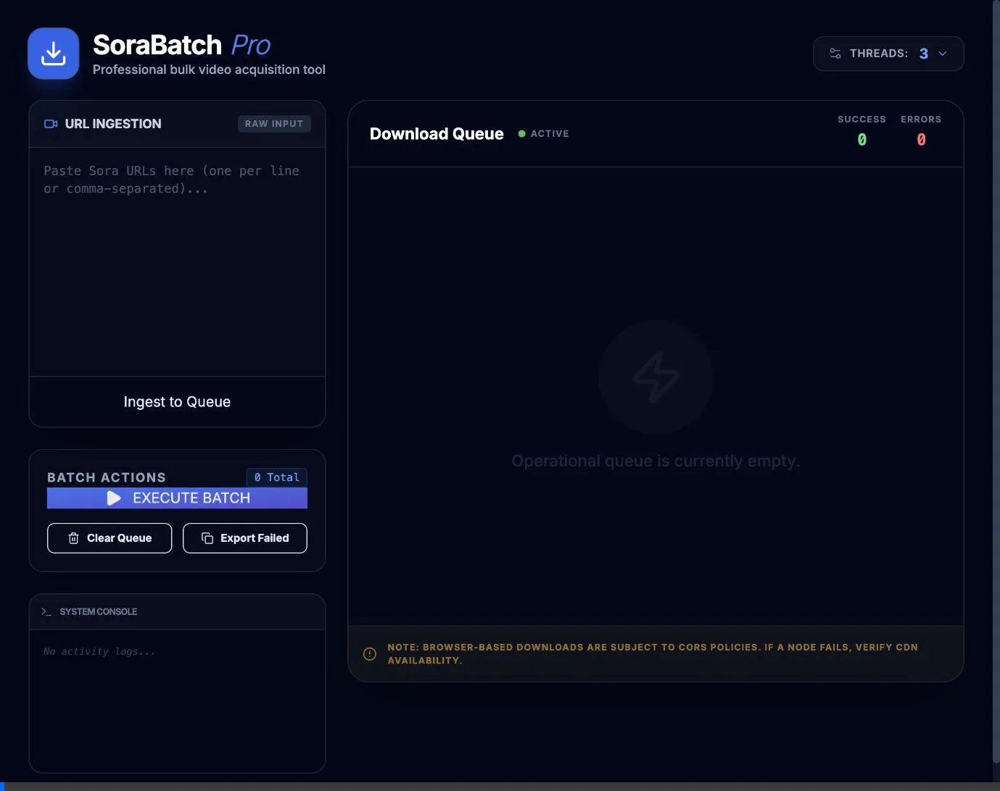

# SoraBatch Pro

A high-performance batch downloader for Sora videos featuring concurrent download management, intelligent queue processing, and comprehensive system logging.

## Features

- **🚀 Concurrent Downloads**: Configure parallel download threads (1-16) for optimal performance
- **📋 Queue Management**: Add, manage, and monitor multiple video downloads in a visual queue
- **🔄 Smart Processing**: Automatic retry capability for failed downloads
- **📊 Real-time Monitoring**: Live status updates with success/error tracking
- **💾 System Logging**: Timestamped activity console for debugging and monitoring
- **🎯 URL Extraction**: Automatic Sora video ID extraction from URLs
- **⚡ Batch Operations**: Execute, abort, and clear queue operations
- **📤 Export Failed URLs**: Easy copy-to-clipboard for failed download URLs

## Demo



## Prerequisites

- **Node.js** (v16 or higher recommended)
- Modern web browser with JavaScript enabled

## Installation

1. Clone the repository:
   ```bash
   git clone https://github.com/lgcarrier/sora-batch-downloader.git
   cd sora-batch-downloader
   ```

2. Install dependencies:
   ```bash
   npm install
   ```

## Usage

1. Start the development server:
   ```bash
   npm run dev
   ```

2. Open your browser and navigate to the local development URL (typically `http://localhost:5173`)

3. **Adding Videos to Queue**:
   - Paste Sora video URLs in the input area (one per line or comma-separated)
   - Click "Ingest to Queue" to add them to the download queue

4. **Configuring Downloads**:
   - Adjust the "Threads" setting (1-16) to control concurrent downloads
   - Higher values = faster batch processing but more resource usage

5. **Managing Downloads**:
   - Click "EXECUTE BATCH" to start downloading
   - Click "ABORT SEQUENCE" to stop ongoing downloads
   - Use "Clear Queue" to remove all items
   - Click "Export Failed" to copy failed URLs for retry

6. **Monitoring**:
   - Watch the queue for real-time status updates
   - Check the System Console for detailed activity logs
   - View success/error counts in the queue header

## Building for Production

```bash
npm run build
```

The production-ready files will be generated in the `dist` directory.

To preview the production build:
```bash
npm run preview
```

## Tech Stack

- **React 19** - UI framework
- **TypeScript** - Type-safe development
- **Vite** - Build tool and dev server
- **Tailwind CSS** - Styling (via inline classes)
- **Lucide React** - Icon library

## How It Works

1. URLs are parsed to extract Sora video IDs
2. CDN URLs are constructed using the format: `https://oscdn2.dyysy.com/MP4/{id}.mp4`
3. Downloads are queued and processed with configurable concurrency
4. Videos are saved as `Sora_{id}.mp4` to your downloads folder
5. Failed downloads can be retried or exported for later processing

## Browser Compatibility

Modern browsers with ES6+ support:
- Chrome/Edge 90+
- Firefox 88+
- Safari 14+

## Known Limitations

- **CORS Restrictions**: Browser-based downloads are subject to CORS (Cross-Origin Resource Sharing) policies. Some CDN content may require specific headers or may not be accessible due to CORS restrictions. This is a browser security limitation.
- **Download Location**: Videos are downloaded to your browser's default download folder and cannot be customized through the web application.
- **Session Persistence**: Queue state is not persisted across browser sessions. Refreshing the page will clear the queue.

## License

This project is available for personal and educational use.

## Contributing

Contributions are welcome! Please feel free to submit issues or pull requests.
